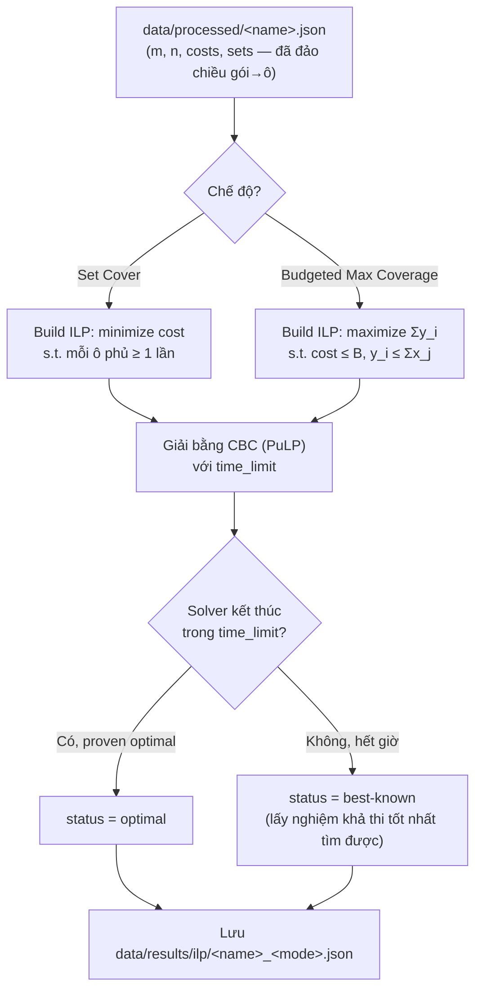

# Thiết kế: ILP solver chính xác (PuLP)

> Mục tiêu: script `scripts/solve_ilp.py`, dùng làm (1) đáp án tối ưu tham chiếu cho mọi mức ngân sách, và (2) công cụ tự tái lập bảng OPT (mục 3 project-brief.md) để xác nhận dữ liệu + pipeline đọc file không có lỗi.

## 1. Hai bài toán, hai công thức ILP khác nhau

Brief phân biệt rõ 2 bài toán (mục 3): **Set Cover** (phủ hết, tối thiểu chi phí — dùng để tính OPT) và **Budgeted Max Coverage** (ngân sách cố định, tối đa hóa số ô phủ — dùng để tính đáp án ở B=75/50/25%). Solver cần chạy được cả hai chế độ.

### Chế độ A — Set Cover (tính OPT)

Biến quyết định: `x_j ∈ {0,1}` — có chọn gói `j` hay không.

```
minimize   Σ_j costs[j] · x_j

subject to Σ_{j: ô i ∈ sets[j]} x_j ≥ 1     với mọi ô i ∈ U   (mỗi ô phải được phủ)
           x_j ∈ {0,1}
```

Giá trị tối ưu của bài này chính là `OPT` — dùng để đối chiếu với bảng OPT tham khảo ở mục 3.

### Chế độ B — Budgeted Max Coverage (đáp án ở mức ngân sách B)

Thêm biến `y_i ∈ {0,1}` — ô `i` có được phủ hay không (biến phụ, để tuyến tính hóa hàm "OR" của các gói phủ ô đó).

```
maximize   Σ_i y_i

subject to Σ_j costs[j] · x_j ≤ B                                với mọi gói đã chọn (ràng buộc ngân sách)
           y_i ≤ Σ_{j: ô i ∈ sets[j]} x_j     với mọi ô i        (ô chỉ được tính "phủ" nếu có ít nhất 1 gói chọn phủ nó)
           x_j, y_i ∈ {0,1}
```

`B` = `floor(mức% × OPT)` theo đúng quy ước mục 4 (100%/75%/50%/25%, làm tròn xuống).

## 2. Sơ đồ luồng chạy



## 3. Cấu trúc file kết quả

Mỗi lần giải → 1 file `data/results/ilp/<instance>_<mode>.json` (ví dụ `scpa1_setcover.json`, `scpa1_budgeted_75.json`):

| Trường | Ý nghĩa |
|---|---|
| `instance` | tên instance, ví dụ `scpa1` |
| `mode` | `"setcover"` hoặc `"budgeted"` |
| `budget_level` | `null` nếu setcover, hoặc `"75%"` / `"50%"` / `"25%"` nếu budgeted |
| `budget_value` | giá trị `B` thực tế đã dùng (số nguyên), `null` nếu setcover |
| `status` | `"optimal"` hoặc `"best-known"` (hết time limit) |
| `objective` | với setcover: tổng chi phí (= OPT nếu optimal); với budgeted: số ô phủ được |
| `selected_packages` | danh sách chỉ số gói được chọn (0-indexed, khớp `docs/mo-hinh-du-lieu.md`) |
| `solve_time_seconds` | thời gian solver chạy thật |
| `time_limit_seconds` | time limit đã đặt cho lần chạy này |

Format này chính là "file lời giải" đã bàn trước đó — validator (bước sau) sẽ đọc `selected_packages` để tự tính lại cost/coverage.

## 4. Tham số dòng lệnh

```
python scripts/solve_ilp.py --instances scpa1,scp61 --modes setcover,budgeted --time-limit 120
```

- `--instances`: danh sách tên instance (mặc định: tất cả trong `data/processed/`).
- `--modes`: `setcover`, `budgeted`, hoặc cả hai (mặc định: cả hai).
- `--time-limit`: giây, cho **mỗi lần giải riêng lẻ** (mặc định 120s khi test; batch thật sau này sẽ gọi lại với `--time-limit 1800` tức 30 phút theo brief mục 4).
- Chế độ `budgeted` cần `OPT` đã biết trước để tính `B` → dùng **bảng OPT tham khảo ở mục 3 project-brief.md** (hard-code trong script), vì đây là số liệu có sẵn cho đúng 45 instance đang dùng. Nếu instance không có trong bảng tham khảo, script báo lỗi rõ ràng và bỏ qua thay vì đoán.
- Mức `B = 100% OPT` **không cần giải ILP** (đúng mục 4: đây là mốc kiểm tra miễn phí) → mặc định `--modes budgeted` chỉ chạy 3 mức 75%/50%/25%. Muốn kiểm tra mức 100% thì dùng trực tiếp kết quả từ chế độ `setcover` (tập gói đó phủ 100% với chi phí = OPT).

## 5. Kế hoạch test trong phiên này

- **Không chạy full 45 file** (theo yêu cầu, để dành batch thật chạy riêng sau, có thể mất hàng chục giờ với time-limit 30 phút/file).
- Test trên 2-3 instance **nhỏ nhất**: `scp61`–`scp65` (200 ô × 1000 gói, mật độ 5% — thường dễ giải hơn 2%) hoặc `scpa1` (300×3000). Dùng `--time-limit` ngắn (vài chục giây đến vài phút) khi test.
- Đối chiếu `objective` của chế độ setcover với bảng OPT mục 3 (ví dụ bộ 6: 138, 146, 145, 131, 161; bộ A: 253, 252, 232, 234, 236).
- Kiểm tra hệ quả 1 (mục 5): budgeted ở B < OPT phải cho `objective < m` (không thể phủ 100%).

## 6. Việc để lại cho lần sau (ngoài phạm vi hôm nay)

- Chạy full batch 45 file × (1 setcover + 3 mức budget) = 180 lần giải, time-limit 10–30 phút/lần theo đúng brief mục 4 — sẽ tốn nhiều giờ, nên chạy riêng (background), không nằm trong phiên demo này.
- Viết validator (script kiểm tra chung, mục 8) — đọc `selected_packages` từ các file kết quả (kể cả từ heuristic, không riêng ILP) để tự tính lại cost/coverage.
