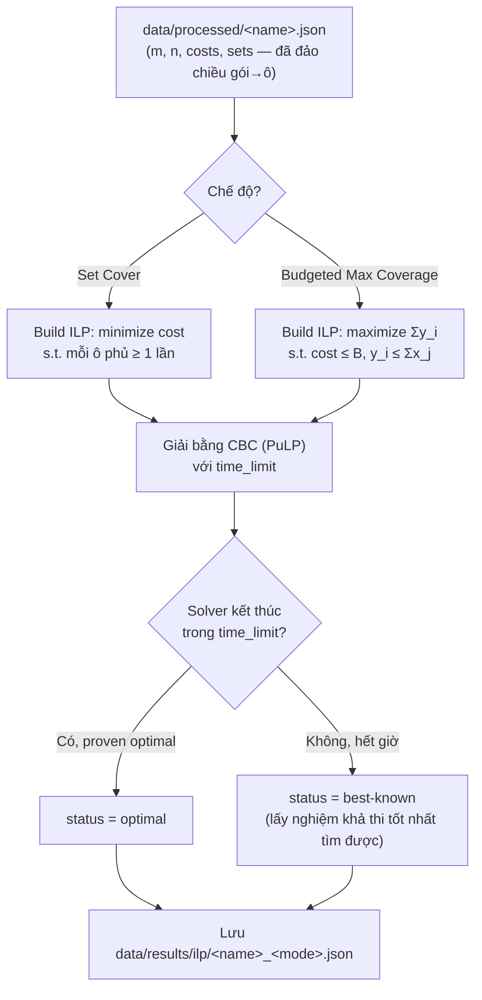

# Thiết kế: ILP solver chính xác (PuLP)

> Mục tiêu: script `pipeline/03_solve_ilp.py`, dùng làm (1) đáp án tối ưu tham chiếu cho mọi mức ngân sách, và (2) công cụ tự tái lập bảng OPT (`pipeline/opt_reference.py`) để xác nhận dữ liệu + pipeline đọc file không có lỗi.

## 1. Hai bài toán, hai công thức ILP khác nhau

Có hai bài toán khác nhau cần phân biệt: **Set Cover** (phủ hết, tối thiểu chi phí — dùng để tính OPT) và **Budgeted Max Coverage** (ngân sách cố định, tối đa hóa số ô phủ — dùng để tính đáp án ở B=75/50/25%). Solver cần chạy được cả hai chế độ.

### Chế độ A — Set Cover (tính OPT)

Biến quyết định: `x_j ∈ {0,1}` — có chọn gói `j` hay không.

```
minimize   Σ_j costs[j] · x_j

subject to Σ_{j: ô i ∈ sets[j]} x_j ≥ 1     với mọi ô i ∈ U   (mỗi ô phải được phủ)
           x_j ∈ {0,1}
```

Giá trị tối ưu của bài này chính là `OPT` — dùng để đối chiếu với bảng OPT tham khảo ở mục 3.

### Chế độ B — Budgeted Max Coverage (đáp án ở mức ngân sách B)

Thêm biến `y_i ∈ {0,1}` — ô `i` có được phủ hay không (biến phụ, để tuyến tính hóa hàm "OR" của các gói phủ ô đó).

```
maximize   Σ_i y_i

subject to Σ_j costs[j] · x_j ≤ B                                (ràng buộc ngân sách: tổng chi phí các gói được chọn)
           y_i ≤ Σ_{j: ô i ∈ sets[j]} x_j     với mọi ô i        (ô chỉ được tính "phủ" nếu có ít nhất 1 gói chọn phủ nó)
           x_j, y_i ∈ {0,1}
```

`B` = `floor(mức% × OPT)` theo đúng quy ước mục 4 (100%/75%/50%/25%, làm tròn xuống).

## 2. Sơ đồ luồng chạy


```mermaid
flowchart TD
    A["data/processed/&lt;name&gt;.json\n(m, n, costs, sets — đã đảo chiều gói→ô)"] --> B{"Chế độ?"}
    B -->|"Set Cover"| C["Build ILP: minimize cost\ns.t. mỗi ô phủ ≥ 1 lần"]
    B -->|"Budgeted Max Coverage"| D["Build ILP: maximize Σy_i\ns.t. cost ≤ B, y_i ≤ Σx_j"]
    C --> E["Giải bằng CBC (PuLP)\nvới time_limit"]
    D --> E
    E --> F{"Solver kết thúc\ntrong time_limit?"}
    F -->|"Có, proven optimal"| G["status = optimal"]
    F -->|"Không, hết giờ"| H["status = best-known\n(lấy nghiệm khả thi tốt nhất tìm được)"]
    G --> I["Lưu data/results/ilp/&lt;name&gt;_&lt;mode&gt;.json"]
    H --> I
```

## 3. Cấu trúc file kết quả

Mỗi lần giải → 1 file `data/results/ilp/<instance>_<mode>.json` (ví dụ `scpa1_setcover.json`, `scpa1_budgeted_75.json`):

| Trường | Ý nghĩa |
|---|---|
| `instance` | tên instance, ví dụ `scpa1` |
| `mode` | `"setcover"` hoặc `"budgeted"` |
| `budget_level` | `null` nếu setcover, hoặc `"75%"` / `"50%"` / `"25%"` nếu budgeted |
| `budget_value` | giá trị `B` thực tế đã dùng (số nguyên), `null` nếu setcover |
| `status` | `"optimal"` hoặc `"best-known"` (hết time limit) |
| `objective` | với setcover: tổng chi phí (= OPT nếu optimal); với budgeted: số ô phủ được |
| `selected_packages` | danh sách chỉ số gói được chọn (0-indexed, khớp `docs/mo-hinh-du-lieu.md`) |
| `solve_time_seconds` | thời gian solver chạy thật |
| `time_limit_seconds` | time limit đã đặt cho lần chạy này |

Format này chính là "file lời giải" đã bàn trước đó — validator (bước sau) sẽ đọc `selected_packages` để tự tính lại cost/coverage.

## 4. Tham số dòng lệnh

```
python pipeline/03_solve_ilp.py --instances scpa1,scp61 --modes setcover,budgeted --time-limit 120
```

- `--instances`: danh sách tên instance (mặc định: tất cả trong `data/processed/`).
- `--modes`: `setcover`, `budgeted`, hoặc cả hai (mặc định: cả hai).
- `--time-limit`: giây, cho **mỗi lần giải riêng lẻ** (mặc định 120s). Batch đầy đủ 45 instance đã chạy với `--time-limit 600` (10 phút); thực tế không lần giải nào chạm giới hạn này.
- Chế độ `budgeted` cần `OPT` đã biết trước để tính `B` → dùng **bảng OPT tham khảo** `pipeline/opt_reference.py` (nguồn: Ohlsson, Peterson & Söderberg 1999, bảng C2; hard-code trong script), vì đây là số liệu có sẵn cho đúng 45 instance đang dùng. Nếu instance không có trong bảng tham khảo, script báo lỗi rõ ràng và bỏ qua thay vì đoán.
- Mức `B = 100% OPT` **không cần giải ILP** (đúng mục 4: đây là mốc kiểm tra miễn phí) → mặc định `--modes budgeted` chỉ chạy 3 mức 75%/50%/25%. Muốn kiểm tra mức 100% thì dùng trực tiếp kết quả từ chế độ `setcover` (tập gói đó phủ 100% với chi phí = OPT).

## 5. Kết quả chạy đầy đủ (45 instance)

Đã chạy đủ 45 instance × (1 setcover + 3 mức budgeted) = **180 lần giải**, `time_limit = 600s`, kết quả nằm ở `data/results/ilp/`.

- **Tất cả 180 lần đều `status = "optimal"`** — không có lần nào hết giờ, nên không có kết quả `best-known` nào; các con số ở B = 75/50/25% là tối ưu thật sự, không phải cận.
- **Tái lập OPT:** cả 45 nghiệm setcover khớp đúng bảng OPT tham khảo (`pipeline/opt_reference.py`), và mỗi nghiệm phủ đủ 100% ô. Việc này đồng thời xác nhận code đọc/chuyển đổi dữ liệu (`pipeline/02_convert_to_input.py`) không có lỗi.
- **Hệ quả 1 (xem README, mục "Bài toán và khái niệm nền"):** mọi nghiệm budgeted ở B < OPT đều phủ < m ô; chi phí luôn ≤ B.
- **Thời gian:** mỗi lần giải tối đa ~14 giây (setcover tối đa ~10 giây, tổng 45 lần setcover ~54 giây), thấp hơn nhiều so với dự tính "hàng chục giờ" ban đầu.
- **Kiểm tra lại bằng validator:** `python pipeline/05_validate_solution.py` (xem mục 6) tự tính lại chi phí/độ phủ từ `selected_packages` của cả 180 file, không phụ thuộc số liệu solver tự báo cáo.

## 6. Validator chung

`pipeline/05_validate_solution.py` đọc mọi file kết quả (ILP, greedy và các heuristic sau này — miễn đúng format mục 3) và tự tính lại từ `data/processed/<instance>.json`. Nó báo lỗi khi:

- chỉ số gói ngoài phạm vi `[0, n-1]`, hoặc có gói chọn trùng;
- `cost` (nếu file có trường này) hoặc `objective` không khớp số tính lại;
- chi phí vượt ngân sách `B`, hoặc `budget_value` không bằng `floor(mức% × OPT)`;
- phủ 100% ô trong khi `B < OPT` (Hệ quả 1);
- với setcover: chưa phủ hết ô, hoặc chi phí nhỏ hơn OPT tham khảo.

```
python pipeline/05_validate_solution.py                              # quét đệ quy toàn bộ data/results/
python pipeline/05_validate_solution.py --results-dir data/results/greedy
```

Thoát với mã 1 nếu có lỗi (dùng được trong CI hoặc trước khi nộp kết quả). Test: `tests/test_validate_solution.py`.

## 7. Việc còn lại liên quan đến ILP

- Chưa có bảng tổng hợp gap giữa heuristic và ILP, cũng chưa xuất CSV tổng hợp cho Pha 1; kết quả Pha 1 chỉ ở dạng JSON. (Pha 2 đã có `summary.csv` với cột `instance, algorithm, budget_level, seed, covered_cells, covered_weight, cost, time_seconds`.)
