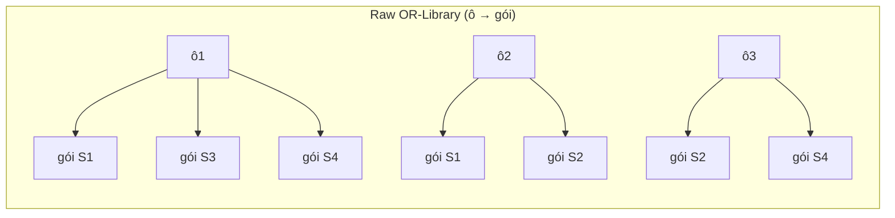
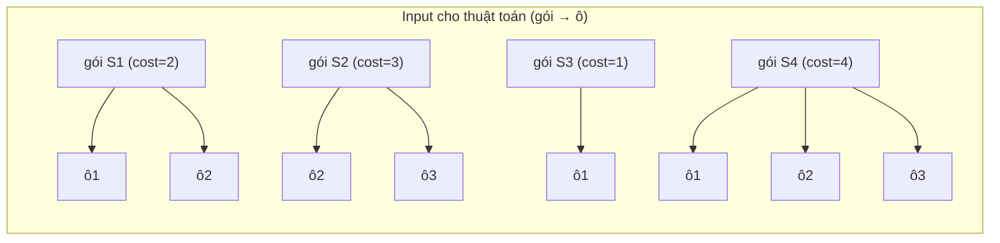
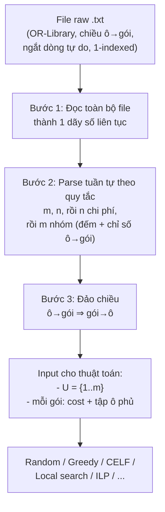

# Mô hình dữ liệu: từ file raw OR-Library đến input cho thuật toán

> Mục đích file này: giải thích **dữ liệu raw hiện có trong `data/raw/OR-Library/` trông như thế nào**, và **dữ liệu mà các thuật toán (greedy, ILP, ...) thực sự cần** khác gì so với raw. Đây là bước hiểu vấn đề, **chưa chốt format lưu trữ cuối cùng** — sau khi đọc xong file này, mình sẽ bàn tiếp thiết kế script chuyển đổi.

## 1. Ví dụ nhỏ để dễ hình dung

Trước khi nhìn vào file thật (713 dòng số, khó đọc bằng mắt), dùng một bài toán tí hon:

- Universe `U` có 3 ô: `{ô1, ô2, ô3}`
- Có 4 gói, mỗi gói phủ một số ô, với chi phí riêng:

| Gói | Chi phí | Phủ những ô nào |
|---|---|---|
| S1 | 2 | ô1, ô2 |
| S2 | 3 | ô2, ô3 |
| S3 | 1 | ô1 |
| S4 | 4 | ô1, ô2, ô3 |

Đây chính là bài toán Budgeted Maximum Coverage mô tả ở mục 1 project-brief.md — chỉ là thu nhỏ lại để nhìn cho rõ.

## 2. File raw OR-Library được ghi theo chiều "ô → gói"

File gốc **không** lưu theo bảng ở trên (gói → ô nó phủ). Nó lưu **ngược lại**: với mỗi ô, liệt kê **những gói nào phủ ô đó**. Đây là quy ước riêng của định dạng OR-Library (mục 2 project-brief.md).

Nếu ghi ví dụ 3 ô/4 gói ở trên theo đúng kiểu file thật, nó sẽ là:

```
3 4              <- m n: 3 ô, 4 gói
2 3 1 4          <- chi phí của gói S1, S2, S3, S4 (theo đúng thứ tự)
3 1 3 4          <- ô1: có 3 gói phủ nó, là gói số 1, 3, 4
2 1 2            <- ô2: có 2 gói phủ nó, là gói số 1, 2
2 2 4            <- ô3: có 2 gói phủ nó, là gói số 2, 4
```

So khớp lại với bảng ở mục 1: ô1 được phủ bởi S1, S3, S4 ✓ — đúng.

**Lưu ý quan trọng (đã ghi ở mục 2 project-brief.md):**
- Các số này **không bắt buộc mỗi dòng một ý nghĩa cố định** — file thật có thể ngắt dòng tùy ý giữa chừng một danh sách. Ví dụ dòng "3 1 3 4" ở trên có thể trong file thật bị tách thành 2 dòng "3 1" và "3 4". Vì vậy khi đọc file, **không đọc theo từng dòng**, mà phải đọc **toàn bộ file thành một dãy số liên tục**, rồi tự bóc tách theo đúng quy tắc (m, n, rồi n chi phí, rồi lặp qua từng ô: 1 số đếm + danh sách chỉ số).
- Chỉ số gói là **1-indexed** (gói đầu tiên là số 1, không phải 0).

Ví dụ thật, 13 dòng đầu của `data/raw/OR-Library/scp41.txt`:

```
 200 1000          <- m=200 ô, n=1000 gói
 1 1 1 1 1 1 ...   <- 1000 số chi phí, bắt đầu ngắt dòng tự do
 2 2 2 2 2 2 ...
 ...
```

## 3. Sơ đồ: chiều lưu trong raw file



Mỗi ô "trỏ tới" các gói phủ nó. Đây là chiều lưu trong file, **không phải chiều mà thuật toán cần dùng**.

## 4. Cái thuật toán thực sự cần: chiều "gói → ô"

Mọi thuật toán trong danh sách mục 7 (greedy, CELF, local search, ILP...) đều hoạt động theo logic: **"nếu tôi chọn gói này, tôi được thêm những ô nào?"** — tức là cần tra cứu theo **gói → tập ô nó phủ**, ngược lại hoàn toàn với raw file.



Đây chính là lý do project-brief.md nhấn mạnh: **"code đọc dữ liệu phải đảo lại thành gói → ô"** — không phải chi tiết vặt, mà là bước bắt buộc để dữ liệu dùng được.

## 5. Toàn bộ pipeline chuyển đổi



## 6. Dữ liệu thuật toán cần, ở mức khái niệm (chưa phải format file cuối cùng)

Bất kể sau này lưu bằng JSON, pickle hay cấu trúc Python thuần, thuật toán cần truy cập được 3 thứ:

| Thành phần | Ý nghĩa | Ví dụ (bài toán tí hon ở mục 1) |
|---|---|---|
| `m` | số ô trong universe | 3 |
| `costs[j]` | chi phí của gói thứ `j` | `costs = [2, 3, 1, 4]` |
| `sets[j]` | tập ô mà gói thứ `j` phủ (0-indexed hoặc 1-indexed — cần thống nhất) | `sets = [{1,2}, {2,3}, {1}, {1,2,3}]` |

Đây là phần sẽ bàn kỹ khi thiết kế script chuyển đổi (file/định dạng lưu, 0-indexed hay giữ 1-indexed, có cache lại để khỏi parse lại mỗi lần chạy hay không...).

## 7. Điểm cần nhớ khi implement

- **Không đọc theo dòng** — đọc toàn file thành dãy số rồi parse tuần tự (mục 2).
- **Đảo chiều bắt buộc**: raw là ô→gói, thuật toán cần gói→ô.
- **1-indexed trong file**, cẩn thận khi chuyển sang mảng 0-indexed trong code.
- `scp410.txt` và `scp510.txt` từng bị lệch vị trí khi tải (đã tải xong và nằm trong `data/raw/OR-Library/`, không ảnh hưởng bước parse này).
